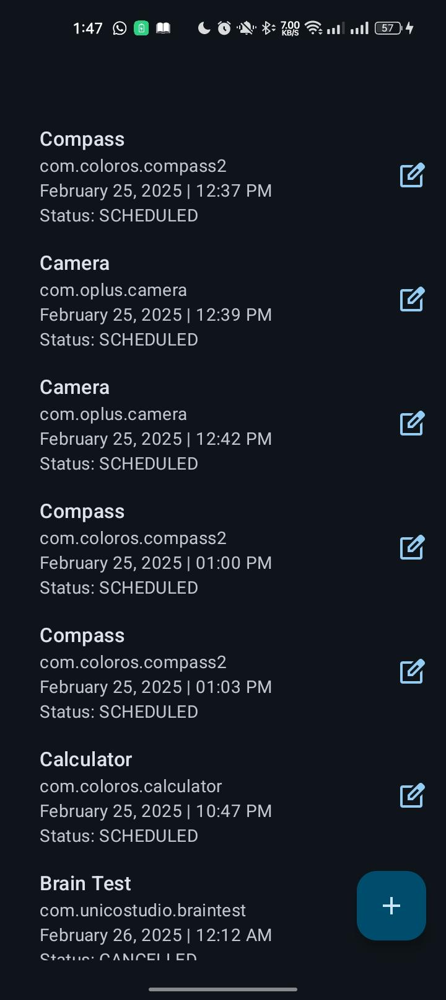
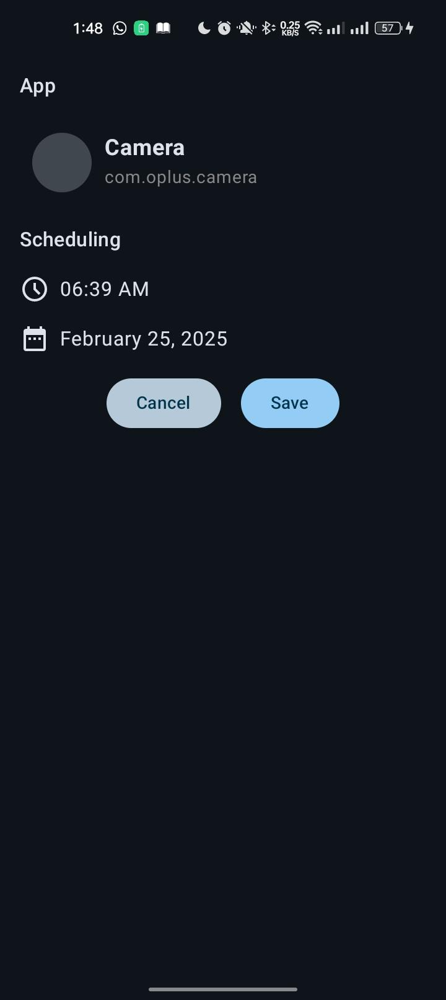
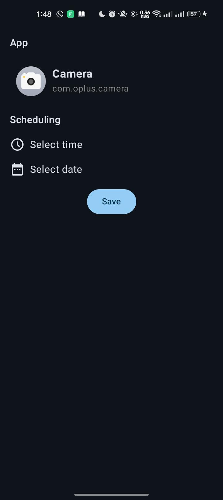
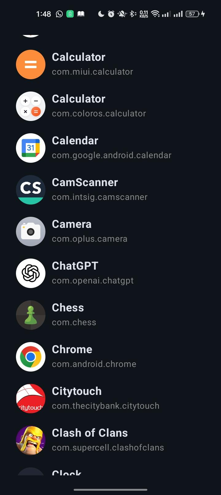

# **App Schedule**

This Android application allows users to schedule any installed app to start at a specific time, cancel a scheduled start, or modify an existing schedule. The application supports multiple schedules for the same app.

---

## **✨ Features**

- **Schedule App Launch** – Users can schedule any installed app to launch at a specific time.
- **Cancel Schedule** – If the scheduled app has not yet started, users can cancel the schedule.
- **Modify Schedule** – Users can change the time of an already scheduled app launch.
- **Multiple Schedules** – The app supports multiple schedules without conflicts, ensuring smooth and efficient scheduling.
- **Schedule History** – A record is kept of each schedule.

---

## **🛠 Tools and Technologies Used**

- **Jetpack Compose**
- **Clean Architecture**
- **MVI**
- **Room Database**
- **Compose Type-Safe Navigation**
- **Dagger Hilt**
- **Kotlin Coroutines & Flow**
- **Desugar JDK Libs**
- **Unit Testing**

---

## **📂 App Package Structure**

```plaintext
📂 app
├── 📂 manifests
│   └── 📄 AndroidManifest.xml
├── 📂 kotlin+java
│   └── 📂 com.peal.appscheduler
│       ├── 📂 data
│       │   ├── 📂 local
│       │   │   ├── 📂 model
│       │   │   │   ├── 📝 ScheduleEntity.kt
│       │   │   ├── 📝 ScheduleDao.kt
│       │   │   ├── 📝 SchedulerAppDatabase.kt
│       │   ├── 📂 mappers
│       │   │   ├── 📝 ScheduleMappers.kt
│       │   ├── 📂 repositoryImpl
│       │   ├── 📂 wrapper
│       ├── 📂 di
│       │   ├── 📝 AppModule.kt
│       │   ├── 📝 DatabaseModule.kt
│       │   ├── 📝 RepositoryModule.kt
│       ├── 📂 domain
│       │   ├── 📂 enums
│       │   ├── 📂 mappers
│       │   ├── 📂 model
│       │   ├── 📂 repository
│       │   ├── 📂 usecase
│       │   ├── 📂 utils
│       ├── 📂 ui
│       │   ├── 📂 model
│       │   ├── 📂 navigation
│       │   ├── 📂 screens
│       │   ├── 📂 theme
│       ├── 📂 service
│       └── 📂 receiver


### **<u>ScreenShots</u>**
<p align="center">     </p>


