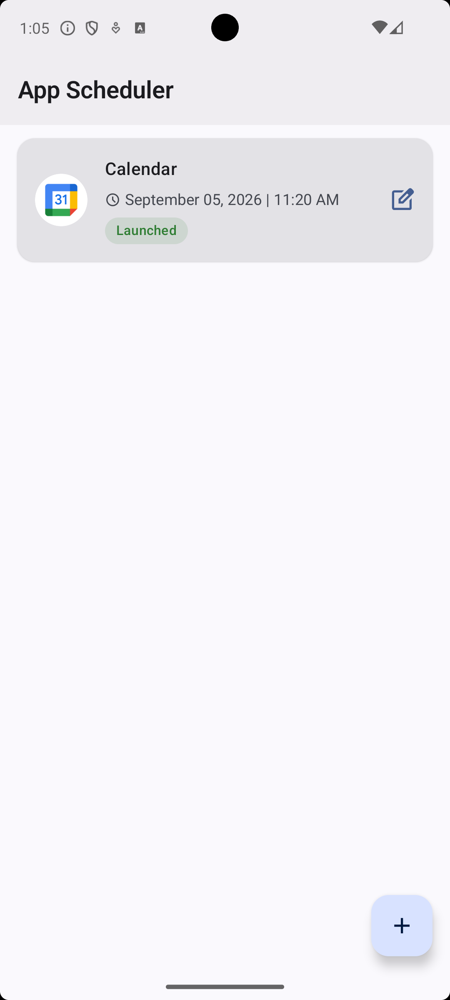
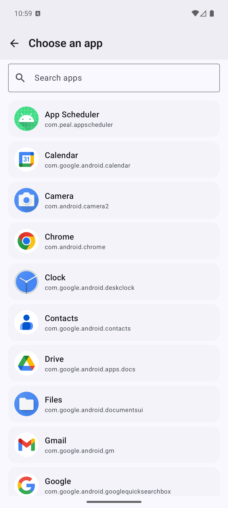
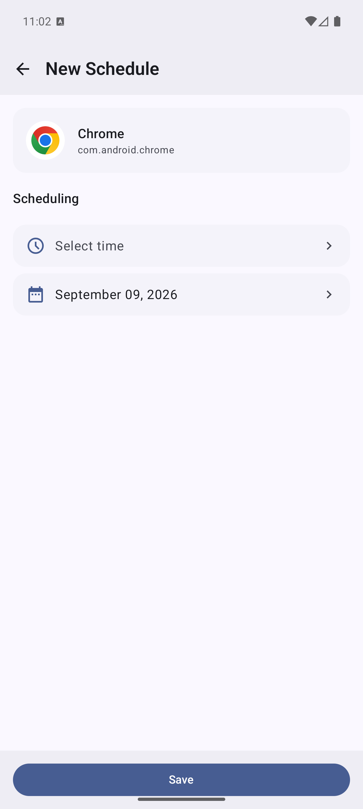

# App Scheduler

App Scheduler is a native Android app that launches any installed app for you at a date and
time you choose. Set it up once — "open Camera at 7:00 AM" or "launch Chrome every workday at
9:00" — and the schedule survives app restarts, backgrounding, and even a device reboot. It
keeps a running history of every schedule (scheduled, launched, failed, or cancelled) so you
always know what happened.

## Screenshots

<p align="center">
  
  
  
</p>

## Features

- **Browse and search** every launchable app installed on the device.
- **Schedule** an app to launch at a future date and time.
- **Edit or cancel** a pending schedule at any time before it fires.
- **Status tracking** for every schedule — `Scheduled`, `Launched`, `Failed`, or `Cancelled` —
  shown with color-coded badges on the home screen.
- **Conflict prevention** — you can't create two pending schedules for the exact same time.
- **Survives reboot** — pending schedules are automatically re-armed after the device restarts.
- **Doze-tolerant timing** — alarms use `setExactAndAllowWhileIdle`, so a schedule still fires on
  time even if the device has gone idle.
- **In-app feedback** via Material 3 snackbars, and system notifications while a launch is in
  progress or if one fails.
- Full **light and dark themes**, including Android 12+ dynamic color.

## How it works

App Scheduler's job is to reliably do one thing — start an app at a specific moment — even after
the app that scheduled it has been closed. The flow:

1. **Pick an app and a time.** The scheduler screen writes the schedule to a local Room database
   and asks `AlarmManager` to fire a `setExactAndAllowWhileIdle` alarm for that instant.
2. **The alarm fires** into `AppSchedulerReceiver`, a `BroadcastReceiver` that starts a short-lived
   foreground service (`AppLaunchService`).
3. **The service launches the target app** via `PackageManager.getLaunchIntentForPackage`, updates
   the schedule's status in the database, and shows a notification if the app couldn't be started
   (for example, if it was uninstalled in the meantime).
4. **On device boot**, `AppSchedulerReceiver` starts `RescheduleService`, which reads every still-
   pending schedule from Room and re-arms its alarm — so a reboot never silently drops a schedule.

Everything after step 1 runs independently of the app's UI process, which is why the permissions
below exist.

## Architecture

The codebase follows a conventional Clean Architecture split, with each screen built as an
MVI-style contract (`State` / `Intent` / `Effect`):

```
UI (Compose)  →  ViewModel  →  UseCase (domain)  →  Repository (domain interface)  →  Room / AlarmManager / PackageManager
```

- **`ui/`** — Compose screens, navigation (Navigation 3, type-safe routes), shared components,
  and theme. Each screen is split into a stateful `*Route` composable and a stateless, previewable
  screen composable.
- **`domain/`** — Models, repository interfaces, and use cases. This is where business rules live
  (for example, rejecting a schedule that conflicts with an existing one, or one that's in the past).
- **`data/`** — Room database and DAO, entity mappers, and the concrete repository implementations
  the domain layer depends on.
- **`di/`** — Hilt modules wiring the graph together.
- **`receiver/`** and **`service/`** — the `BroadcastReceiver` and foreground services that make
  scheduling work outside the app's UI lifecycle (see "How it works" above).
- **`core/`** — small utilities shared across layers (a typed `Result`, lifecycle-aware event
  collection for Compose).

```text
app/src/main/java/com/peal/appscheduler
├── core/        # Shared domain and presentation utilities
├── data/        # Room database, mappers, and repository implementations
├── di/          # Hilt modules
├── domain/      # Models, repositories, and use cases
├── receiver/    # Alarm and boot broadcasts
├── service/     # App-launch and boot-rescheduling foreground services
└── ui/          # Compose screens, navigation, components, and theme
```

## Tech stack

| | |
|---|---|
| Language | Kotlin 2.0 |
| UI | Jetpack Compose, Material 3 (BOM 2024.12.01) |
| Navigation | Navigation 3, type-safe `@Serializable` routes |
| DI | Hilt 2.52 |
| Persistence | Room 2.6.1 |
| Async | Kotlin Coroutines & Flow (1.9.0) |
| Serialization | kotlinx.serialization |
| Scheduling | `AlarmManager` (exact, idle-tolerant) + foreground services |
| Build | AGP 8.13.1, Gradle 8.14 |

## Requirements

- Android Studio (current stable release recommended)
- JDK 17
- Android SDK 36 to compile the project
- A device or emulator running Android 7.0 (API 24) or newer

The app targets Android 16 (API 36) and has a minimum SDK of API 24.

## Get started

1. Clone the repository and open it in Android Studio.
2. Allow Gradle to sync and install the required Android SDK platform if prompted.
3. Connect a device or start an emulator.
4. Run the `app` configuration, or use the command line:

   ```bash
   ./gradlew installDebug
   ```

To build an APK without installing it:

```bash
./gradlew assembleDebug
```

The debug APK is generated at `app/build/outputs/apk/debug/app-debug.apk`.

For a release build, R8 shrinking and obfuscation are enabled
(`./gradlew assembleRelease`); the output is unsigned, so a signing config
must be supplied before distributing it.

## Permissions and device behavior

App Scheduler asks for the access it needs as you use it, not all at once on first launch:

| Permission | Why it's needed |
|---|---|
| **Schedule exact alarms** | Required on Android 12+ so schedules fire at the exact selected time rather than being batched by the system. |
| **Display over other apps** | Lets the app-launch service bring the target app to the foreground from the background when its scheduled time arrives, without the user having tapped anything first. |
| **Notifications** | Reports launch and rescheduling activity (for example, when a scheduled app couldn't be started). Requested on Android 13+. |
| **Receive boot completed** | Lets pending schedules be re-armed automatically after the device restarts. |

Each permission is requested contextually, with a rationale dialog, and the app remains usable if
one is declined — though a declined "exact alarms" or "display over other apps" permission will
prevent that particular schedule from firing. The app can only schedule activities that the
Android package manager exposes as launchable; device-specific battery optimizations and
background-activity restrictions may also affect whether a selected app can be brought to the
foreground.

## Testing

Run local (JVM) unit tests:

```bash
./gradlew testDebugUnitTest
```

Run instrumented tests on a connected device or emulator:

```bash
./gradlew connectedDebugAndroidTest
```

The unit test suite covers the scheduling and cancellation use cases (including alarm-failure and
time-conflict handling), date/time utilities, and ViewModels for the scheduler and device-apps
screens, using fakes rather than mocks for repository dependencies. The instrumented suite covers
Room DAO behavior.

## Continuous integration

Every push and pull request to `main` runs through GitHub Actions
(`.github/workflows/main.yml`): `assembleDebug`, `lintDebug`, and `testDebugUnitTest` all have to
pass, and the resulting debug APK is uploaded as a build artifact on `main`.

## Demo

[Watch the demo video](https://drive.google.com/file/d/1DuLzio6waWi4rietamQvxkGViri4b7dE/view?usp=sharing)

## License

This project is licensed under the [MIT License](LICENSE).
